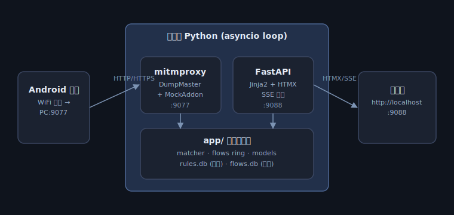
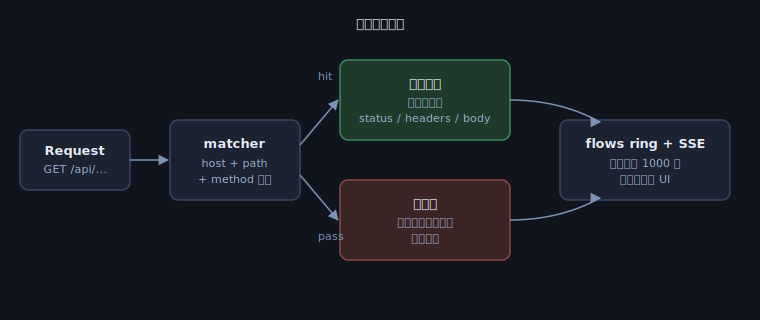

# mock-server

本地 HTTP/HTTPS 代理 + Web UI，按规则改返回值，主要给安卓真机调试用。

- 抓所有经过代理的流量，实时显示
- 按 host / path / method 配置 mock 规则，命中则替换 status / headers / body
- 未命中的请求透传到真实服务器

## 架构



单进程 Python：一个 asyncio loop 里同时跑 mitmproxy（DumpMaster）和 FastAPI（uvicorn）。两边共用 `app/` 下的业务层（规则匹配、流量缓冲、SQLite）。

## 请求流程



## 技术栈

- Python 3.14
- [mitmproxy](https://mitmproxy.org/) 11+ — 代理内核
- FastAPI + Jinja2 + HTMX — Web UI（SSE 推送流量）
- SQLite — `rules.db` 持久化规则与设置，`flows.db` 会话级保存请求/响应体

## 端口

| 端口 | 用途 |
| ---- | ---- |
| 9077 | 代理端口（手机 WiFi 代理填这个） |
| 9088 | Web UI（浏览器打开 `http://localhost:9088`） |

## 启动

```bash
python -m venv venv
source venv/bin/activate
pip install -r requirements.txt

python main.py
```

打开浏览器访问 <http://localhost:9088>。

## 目录结构

```
mock-server/
├── main.py             # 单进程入口，FastAPI app + mitmproxy lifespan
├── requirements.txt
├── app/                # 业务层（UI 无关）
│   ├── db.py           # rules.db / flows.db
│   ├── models.py       # rules / flow_bodies / settings CRUD
│   ├── matcher.py      # 规则匹配 + 冲突检测
│   ├── flows.py        # 流量环形缓冲 + asyncio Queue 订阅
│   ├── addon.py        # MockAddon（应用规则）
│   └── proxy_addon.py  # 原始 req/resp 入库
├── web/
│   ├── routes.py       # 所有 UI 路由
│   ├── templates/      # Jinja2 模板
│   └── static/app.css
├── docs/               # 架构图
└── data/               # 运行时 SQLite
```

## 手机配代理（HTTPS 抓包）

1. 手机 WiFi → 当前网络 → 高级 → 代理 → 手动；主机名填电脑 IP，端口 `9077`
2. 手机浏览器访问 `http://mitm.it` 下载并安装 CA 证书
3. Android 7+ 默认不信任用户 CA：
   - 自己的 app：`network_security_config.xml` 加 `<certificates src="user"/>`
   - 第三方 app：需 root 把 CA 装到系统层
